# COMP7003
### Week2 Lab Report

Will Otterbein, A01372608

## Summary

This report describes my implementation of the week2 polling / event loop lab.

## Obtaining a Program Binary

Information regarding the compiling of this lab into a binary.

For this lab I have created a [`makefile`](./makefile).

You can run `make` & it will output the binary into a `build` directory.
The name of the binary is `rvloop`.

There are make targets, run is dependent on compilation, so if you execute the
following command in your shell

```bash
make run
```

Make will take care of compiling & running the binary.

> this assumes you have make installed already on the system as well as the
> `gcc` compiler, as the makefile expects the `gcc` compiler & uses it for the
> make commands or recipies

To manually compile with `gcc`, the following command or similar should suffice

```bash
# folder & file are simply the names suggested in the lab instructions
gcc ./event-loop/my_event_loop.c -o my-bin
```

## Using the Program

Once a binary has been obtained & the program is running:

1. You will be greated with a blue message that states "PROGRAM START"

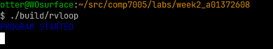

2. From this point onwards the event loop is active, so if you are not inputting
things expect poll messages to be logged every 3 seconds

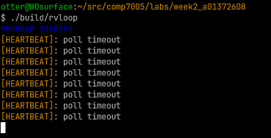

3. The program is polling for input from stdin, so type some stuff & press enter.
4. Your inputs should be printed to stdout, with an echo prefix.

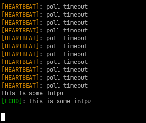

5. after you have had your fun of echoing your own inputs, there are two means
of exiting the program.

6. exit via delivering the EOF with ctrl+d

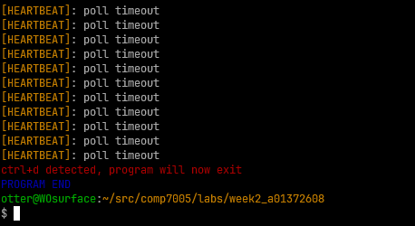

7. or, exit via typing exit & pressing enter

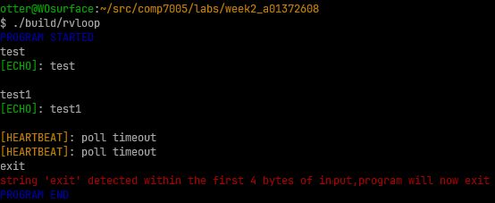

> as you can see, different messages are logged for the different program exit
> routes.

8. finally you will see another blue message stating "PROGRAM END"

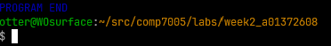

Thats the program! The next section describes the implementation.

## Implementation Description

This event loop program has the following features:
- read from STDIN & echo whatever data therein appears after the user presses
enter
- while there is no data to be read from STDIN, write a 'heartbeat' message
to STDOUT
- exit the program when 'exit' is typed and entered to STDIN


### Global Data

Before we get to the implementation I will describe the contsants / global
data of the program.

You will see at the beginning of the program source file, , that there
are a list of `#defines` for program constants & messages. I did this because
I like using macros for this purpose & some of these are used across functions
so `const char*` would need to passed around or defined globally.

> The messages are written using ansi escape sequencess so that different
> message types are distinguishable (yellow == heartbeat, green == input echo,
> red == error/termination, etc.).

I also
used macros to define the numeric constants `POLL_TIMEOUT`, and `BUF_SIZE`.
`POLL_TIMEOUT` is the intended interval between event loop iterations
(aka how long `poll` should block), the value of this is 3000ms
(or 3s from the lab). A `BUF_SIZE` is also declared, this is the size of the
buffer which STDIN contents are read into (more aboutthis later).

You will also see the `pDone` flag declared as a global `int` type, this flag
when set will break out of the event loop in `main`. In the beginning of `main`
this flag is reset to 0.

Now that the programs global data & constants have been described, The following
sections will detail the implementation of the event loop program.

### `main`

#### Variable Initialization

The program begins by initializing the necessary variables for time-keeping.

| variable name | purpose |
| :- | :- |
| `stime` | start time of the program, used to compute the initial deadline, `dead`|
| `rtime` | running time, computed each iteration of the event loop |
| `dead`  | the next deadline, initally set to `stime + POLL_TIMEOUT`  |
| `left`  | for each iteration of the event, calculated as `dead - rtime` |
| `wait`  | time (ms) to wait `poll`, if `left` is < 0 this value is clamped to 0 |

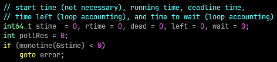

Then a start message is logged w/ the initial program time (`monotime` function
implementation described later).

Next, the `pollfd` struct `s` used by the program is initalized, `fd` is set to
`STDIN_FILENO`, the file descriptor number for STDIN, and `events` is set to
`POLLIN` as this is the only event required for this program (`revents` is
also initialized to 0). The `pDone` flag is reset & the initial 
interval deadline `dead` is calculated.

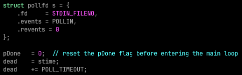

Following section will describe the event loop's implementation.


#### Event Loop & Use of `POLL`

This section of the `main` method constitutes the event loop logic:

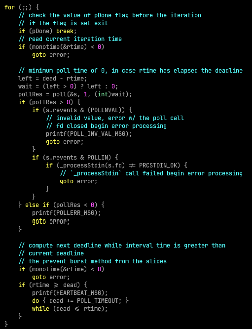

The first thing per iteration is to check whether the `pDone` flag has been
set, if so, break out of the event loop as the program should be done.

Then, the running time, `rtime`, is calculated using the `monotime` helper (w/
error handling). Before `poll` itself can be called, the duration of `poll` needs
to be calculated based of the difference between `dead` & `rtime`, stored in `left`.
If the value of `left` is less than zero (meaning we have exceeded the deadline),
a `wait` value of zero is used.

`poll` is then invoked with the address of `s` (pollfd struct), a count of 1, and
the calculated `wait`, with the result of `poll` being stored in `pollRes`.

The next bit of logic is handling the result of calling `poll`.

Once poll stops blocking, we check if `pollRes > 0` because that means there is data in STDIN to process. Before we pass the processing of that data to `_processStdin`, the program
checks the `revents` to make sure that its not `POLLINVAL`, if it is then we jump
to error processing as this means that the file descriptor passed to `poll` was
closed, meaning STDIN has been closed. If `revents` is `POLLIN`, then we can
proceed with processing STDIN via `_processStdin`, once that call completes
we check its return code & if its not `PRCSTDIN_OK` then this function failed
& we jump to error processing & exit (see the `_processStdin` section for more
info about what the program does w/ STDIN & its return codes).

If `pollRes < 0` there was an error calling poll, we print the message
`POLLERR_MSG` & perform `goto error` to jump ahead to the `main` functions error
handling / cleanup logic.

> if I understood the `man` page for `poll` correctly, `POLLERR` & `POLLHUP` apply
> when the file descriptors passed to `poll` via the `pollfd` struct are sockets
> but we are working w/ STDIN so this does not apply. That is why I don't look
> for these in `revents`

Finally, the next deadline is calculated. I have implemented the version of this
calculation that prevents a burst of messages, so while the current deadline
is less than the running time `POLL_TIMEOUT` is added to the deadline & heartbeats
, `HEARTBEAT_MSG` are logged -- this logic is executed irrespective of the result of poll, so when poll returns 0 ie the timeout has been reached then heartbeats are
still logged.

At some point the user will trigger the end of the program, what this really
means is that `pDone` is set, when that happens the loop is broken out of &
the program logs `PROGRAM_END_MSG` & returns w/ exit code 0.

#### Error Handling & Cleanup

`main` does not allocate any heap memory, so there really is no cleanup to be
done, but we do log `PROGRAM_ERROR_EXIT_MSG` & return with an exit status of 1.

### `_processStdin`

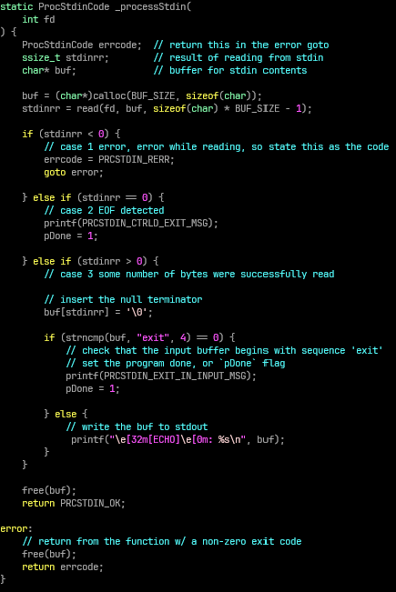

Recall from the description of the event loop that this method is invoked when
`pipe` returns some `n > 0` (for this program it will be 1) & that `revents` is
set to `POLLIN`, meaning there is data to be read. `_processStdin` is invoked
w/ being passed `s.fd` w/ the parameter name `fd`.

#### Variables & initalization

there are three variables defined by `_processStdin`:

| variable name | purpose |
| :- | :- |
| `errcode` | of the enum type `ProcStdinCode` which abstracts the return codes for this function, 0 = OK, 1 = ERROR |
| `stdinn`  | `ssize_t` result of `read` syscall on the passed `fd`, which will be STDIN |
| `buf`     | `char*` buffer where STDIN contents will be written |

#### Reading from `fd` (STDIN)

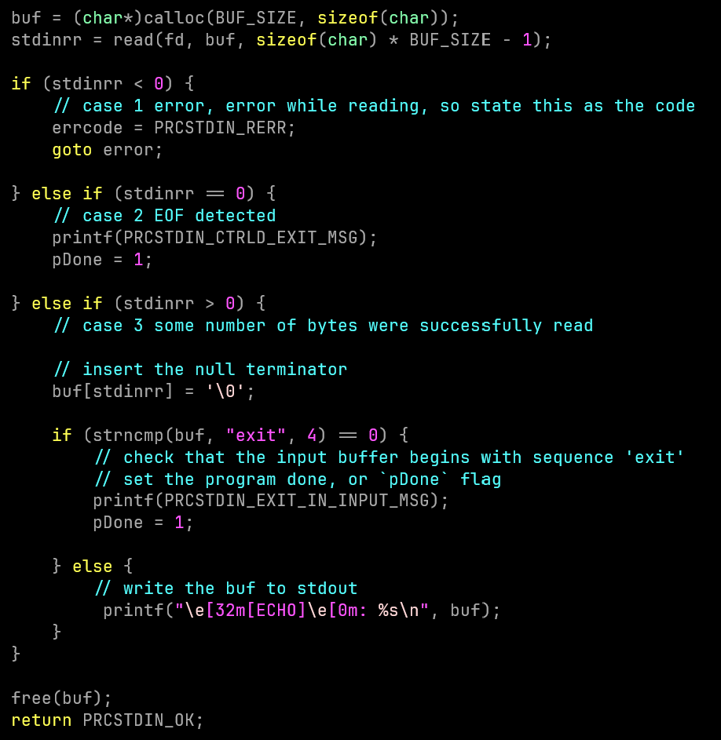

In order to satisfy the required functionality of the program, we need to
read the contents of STDIN, which is the file descriptor value of the `fd` parameter.

`buf` requires allocation at this point of the function & so a call to `calloc`
is made requesting a chunk of memory defined by `BUF_SIZE`.

Now that we have memory to write STDIN to, we can execute the `read` syscall
(we subtract one in order to provide a space for a `\0` terminator character to
be injected). We perform error checking against `read`, if it returns `n < 0`,
then there was an issue executing read & we goto the error handling & cleanup
section of `_processStdin`, assigning `errcode` to the `ProcStdinCode` value 
`PRCSTDIN_RERR` (1). If `read` returns `n == 0`, then EOF has been detected in
STDIN & the program will exit (delivering CTRL+D as an input), so `pDone` is
set to 1. Otherwise, if `read` returns `n > 0`, then at the nth index (so at most
255 or the very end of the buffer) we set the character in the buffer to be `\0`
in order that it is a valid string & `printf` is used to echo the buffer
contents to STDOUT.

An additional exit condition of the program is whether the buffer contents have
'exit' in them. This is very simply determined via `strncmp` w/ the buffer &
`"exit"` literal where `strncmp` is 0 (ie no differences between the first 4
characters of the strings).

Finally, the buffer (`buf`) is freed & in the regular exit case `PRCSTDIN_OK` is
returned.


#### Error Handling & Cleanup

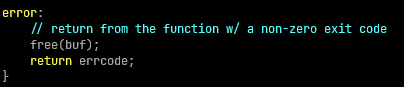

In the error exit case, `_processStdin` still needs to free `buf`. It returns the
code stored in `errcode`.

> return codes for `_processStdin` are defined in the `ProcStdinCode` enum type.
> 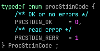

### `monotime`


#### Variables & Initialization

#### Error Handling & Cleanup

